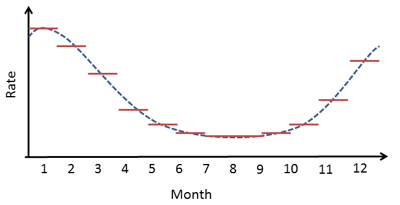
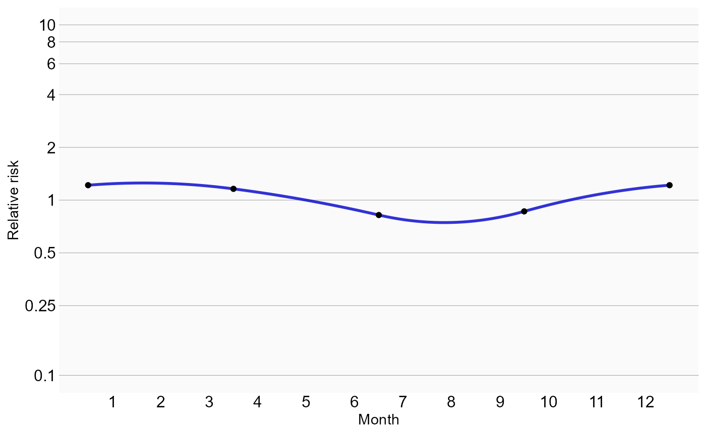
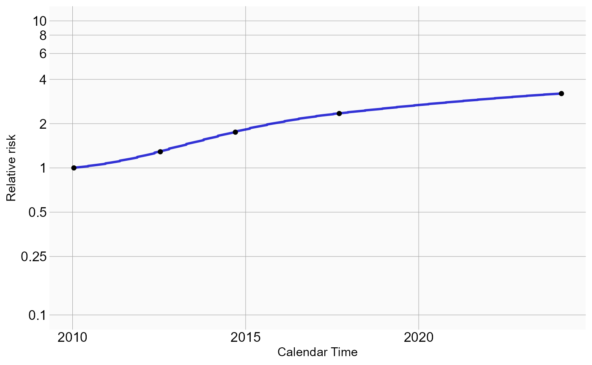
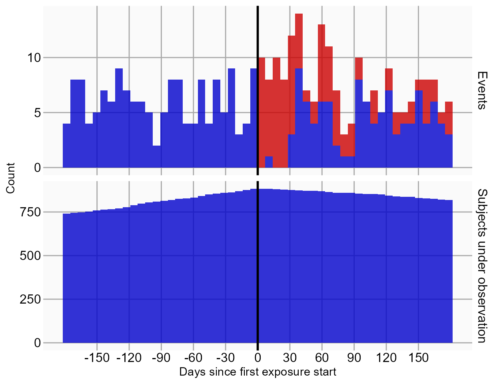
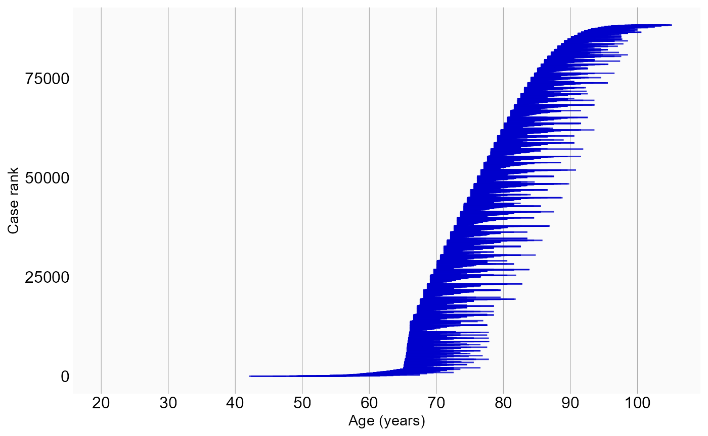

# Single studies using the SelfControlledCaseSeries package

## Introduction

This vignette describes how you can use the `SelfControlledCaseSeries`
package to perform a single Self-Controlled Case Series (SCCS) study. We
will walk through all the steps needed to perform an exemplar study, and
we have selected the well-studied topic of the effect of aspirin on
epistaxis.

### Terminology

The following terms are used consistently throughout the package:

- **Case**: a period of continuous observation of a person containing
  one or more outcomes. One person can contribute to multiple cases, for
  example when the person has multiple observation periods.
- **Observation period**: the time when a person is observed in the
  database, e.g. the time when enrolled in an insurance plan.
- **Nesting cohort**: a cohort defining when persons are eligible to be
  included as cases. This is typically the indication of the drug. For
  example, if the drug treats diabetes, we may want to nest the analysis
  in the time when people have diabetes to avoid (time-varying)
  confounding by indication.
- **Study period**: a period of calendar time when persons are eligible
  to be included as cases. For example, a study period could be January
  1, 2020, onward. Unlike nesting cohorts, which could specify different
  time periods per person, a study period applies to all persons.
- **Naive period**: the first part of a person’s observation period
  (e.g. the first 180 days). This is typically removed from the SCCS
  model to avoid exposure and incident outcome misclassification. For
  example, if we observe the outcome on the second day of a person’s
  observation period, we do not know whether the outcome is a new one or
  just a follow-up for an old one, and whether the patient may have
  started the exposure just prior to observation start without us
  knowing about it.
- **Study population**: the set of cases having a specific outcome, that
  meet certain criteria, such as the naive period and age restrictions.
- **Era**: a data element extracted from the database denoting a time
  period for a patient (a case). This can be a cohort, but also a drug
  era.
- **SCCS data**: a data object containing information on cases,
  observation periods, nesting cohorts, and eras.
- **Covariate**: a time-varying variable used as a predictor for the
  outcome in the SCCS model. These include splines and era covariates.
- **Era covariate**: a covariate derived from an era. Multiple
  covariates can be derived from a single era (e.g. a covariate for when
  on a drug, and a covariate for the pre-exposure time prior to the
  drug). One covariate can be derived from multiple eras (e.g. one
  covariate can represent a class of drugs).
- **SCCS interval data**: data of cases chopped into intervals during
  which all covariates have a constant value. For splines (e.g for
  season), the effect is assumed to be constant within each calendar
  month.
- **SCCS model**: a Poisson regression of SCCS interval data, condition
  on the observation period.

## Installation instructions

Before installing the `SelfControlledCaseSeries` package make sure you
have Java available. For Windows users, RTools is also necessary. See
[these instructions](https://ohdsi.github.io/Hades/rSetup.html) for
properly configuring your R environment.

The `SelfControlledCaseSeries` package is maintained in a [Github
repository](https://github.com/OHDSI/SelfControlledCaseSeries), and can
be downloaded and installed from within R using the `remotes` package:

``` r
install.packages("remotes")
library(remotes)
install_github("ohdsi/SelfControlledCaseSeries") 
```

Once installed, you can type
[`library(SelfControlledCaseSeries)`](https://ohdsi.github.io/SelfControlledCaseSeries/)
to load the package.

## Overview

In the `SelfControlledCaseSeries` package a study requires at least
three steps:

1.  Loading the necessary data from the database.

2.  Transforming the data into a format suitable for an SCCS study. This
    step can be broken down in multiple tasks:

- Defining a study population, people having a specific outcome, with
  possible further restrictions such as age.
- Creating covariates based on the variables extracted from the
  database, such as defining risk windows based on exposures.
- Transforming the data into non-overlapping time intervals, with
  information on the various covariates and outcomes per interval.

3.  Fitting the model using conditional Poisson regression.

In the following sections these steps will be demonstrated for
increasingly complex studies.

## Studies with a single drug

### Configuring the connection to the server

We need to tell R how to connect to the server where the data are.
`SelfControlledCaseSeries` uses the `DatabaseConnector` package, which
provides the `createConnectionDetails` function. Type
`?createConnectionDetails` for the specific settings required for the
various database management systems (DBMS). For example, one might
connect to a PostgreSQL database using this code:

``` r
connectionDetails <- createConnectionDetails(dbms = "postgresql", 
                                             server = "localhost/ohdsi", 
                                             user = "joe", 
                                             password = "supersecret")

cdmDatabaseSchema <- "my_cdm_data"
cohortDatabaseSchema <- "my_results"
cohortTable <- "my_cohorts"
options(sqlRenderTempEmulationSchema = NULL)
```

The last lines define the `cdmDatabaseSchema`, `cohortDatabaseSchema`,
and `cohortTable` variables. We’ll use these later to tell R where the
data in CDM format live, where we have stored our cohorts of interest,
and what version CDM is used. Note that for Microsoft SQL Server,
`databaseSchemas` need to specify both the database and the schema, so
for example `cdmDatabaseSchema <- "my_cdm_data.dbo"`. For database
platforms that do not support temp tables, such as Oracle, it is also
necessary to provide a schema where the user has write access that can
be used to emulate temp tables. PostgreSQL supports temp tables, so we
can set `options(sqlRenderTempEmulationSchema = NULL)` (or not set the
`sqlRenderTempEmulationSchema` at all.)

### Preparing the exposure and outcome of interest

We need to define the exposure and outcome for our study. For the
exposure, we will directly use the `drug_era` table in the CDM. For the
outcome we can use the OHDSI `PhenotypeLibrary` package to retrieve a
community-approved definition of epistaxis:

``` r
epistaxis <- 356
cohortDefinitionSet <- PhenotypeLibrary::getPlCohortDefinitionSet(epistaxis)
```

We can use the `CohortGenerator` package to instantiate this cohort:

``` r
connection <- DatabaseConnector::connect(connectionDetails)
cohortTableNames <- CohortGenerator::getCohortTableNames(cohortTable)
CohortGenerator::createCohortTables(connection = connection,
                                    cohortDatabaseSchema = cohortDatabaseSchema,
                                    cohortTableNames = cohortTableNames)
counts <- CohortGenerator::generateCohortSet(connection = connection,
                                             cdmDatabaseSchema = cdmDatabaseSchema,
                                             cohortDatabaseSchema = cohortDatabaseSchema,
                                             cohortTableNames = cohortTableNames,
                                             cohortDefinitionSet = cohortDefinitionSet)
DatabaseConnector::disconnect(connection)
```

### Extracting the data from the server

Now we can tell `SelfControlledCaseSeries` to extract all necessary data
for our analysis:

``` r
aspirin <- 1112807

sccsData <- getDbSccsData(
  connectionDetails = connectionDetails,
  cdmDatabaseSchema = cdmDatabaseSchema,
  outcomeDatabaseSchema = cohortDatabaseSchema,
  outcomeTable = cohortTable,
  outcomeIds = epistaxis,
  exposureDatabaseSchema = cdmDatabaseSchema,
  exposureTable = "drug_era",
  getDbSccsDataArgs = createGetDbSccsDataArgs(
    studyStartDates = "20100101",
    studyEndDates = "21000101",
    maxCasesPerOutcome = 100000,
    exposureIds = aspirin
  )
)
sccsData
```

    ## # SccsData object
    ## 
    ## Exposure cohort ID(s): 1112807
    ## Outcome cohort ID(s): 356
    ## 
    ## Inherits from Andromeda:
    ## # Andromeda object
    ## # Physical location:  E:\andromedaTemp\file4474a7661da.duckdb
    ## 
    ## Tables:
    ## $cases (observationPeriodId, caseId, personId, noninformativeEndCensor, observationPeriodStartDate, startDay, endDay, ageAtObsStart, genderConceptId)
    ## $eraRef (eraType, eraId, eraName, minObservedDate, maxObservedDate)
    ## $eras (eraType, caseId, eraId, eraValue, eraStartDay, eraEndDay)

There are many parameters, but they are all documented in the
`SelfControlledCaseSeries` manual. In short, we are pointing the
function to the table created earlier and indicating which cohort ID in
that table identifies the outcome. Note that it is possible to fetch the
data for multiple outcomes at once. We further point the function to the
`drug_era` table, and specify the concept ID of our exposure of
interest: aspirin. Again, note that it is also possible to fetch data
for multiple drugs at once. In fact, when we do not specify any exposure
IDs the function will retrieve the data for all the drugs found in the
`drug_era` table.

All data about the patients, outcomes and exposures are extracted from
the server and stored in the `sccsData` object. This object uses the
`Andromeda` package to store information in a way that ensures R does
not run out of memory, even when the data are large.

We can use the generic
[`summary()`](https://rdrr.io/r/base/summary.html) function to view some
more information of the data we extracted:

``` r
summary(sccsData)
```

    ## SccsData object summary
    ## 
    ## Exposure cohort ID(s): 1112807
    ## Outcome cohort ID(s): 356
    ## 
    ## Outcome counts:
    ##     Outcome Subjects Outcome Events Outcome Observation Periods
    ## 356            99202         160949                       1e+05
    ## 
    ## Eras:
    ## Number of era types: 2
    ## Number of eras: 169627

#### Saving the data to file

Creating the `sccsData` file can take considerable computing time, and
it is probably a good idea to save it for future sessions. Because
`sccsData` uses `Andromeda`, we cannot use R’s regular save function.
Instead, we’ll have to use the
[`saveSccsData()`](https://ohdsi.github.io/SelfControlledCaseSeries/reference/saveSccsData.md)
function:

``` r
saveSccsData(sccsData, "sccsData.zip")
```

We can use the
[`loadSccsData()`](https://ohdsi.github.io/SelfControlledCaseSeries/reference/loadSccsData.md)
function to load the data in a future session.

### Creating the study population

From the data fetched from the server we can now define the population
we wish to study. If we retrieved data for multiple outcomes, we should
now select only one, and possibly impose further restrictions:

``` r
studyPop <- createStudyPopulation(
  sccsData = sccsData,
  outcomeId = epistaxis,
  createStudyPopulationArgs = createCreateStudyPopulationArgs(
    firstOutcomeOnly = FALSE,
    naivePeriod = 180
  )
)
```

Here we specify we wish to study the outcome with the ID stored in
`epistaxis`. Since this was the only outcome for which we fetched the
data, we could also have skipped this argument. We furthermore specify
that the first 180 days of observation of every person, the so-called
‘naive period’, will be excluded from the analysis. Note that data in
the naive period will be used to determine exposure status at the start
of follow-up (after the end of the naive period). We also specify we
will use all occurrences of the outcome, not just the first one per
person.

We can find out how many people (if any) were removed by any
restrictions we imposed:

``` r
getAttritionTable(studyPop)
```

    ##   outcomeId outcomeSubjects outcomeEvents outcomeObsPeriods observedDays
    ## 1       356          325890        507256            331800   1211954076
    ## 2       356          207698        323114            211321    573067241
    ## 3       356           99202        160949            100000    285343718
    ## 4       356           87836        135825             88453    240007225
    ##                       description
    ## 1         All outcome occurrences
    ## 2     Outcomes in study period(s)
    ## 3                   Random sample
    ## 4 Requiring 180 days naive period

### Defining a simple model

Next, we can use the data to define a simple model to fit:

``` r
covarAspirin <- createEraCovariateSettings(
  label = "Exposure of interest",
  includeEraIds = aspirin,
  start = 0,
  end = 0,
  endAnchor = "era end"
)

sccsIntervalData <- createSccsIntervalData(
  studyPopulation = studyPop,
  sccsData,
  createSccsIntervalDataArgs =  createCreateSccsIntervalDataArgs(
    eraCovariateSettings = covarAspirin
  )
)

summary(sccsIntervalData)
```

    ## SccsIntervalData object summary
    ## 
    ## Outcome cohort ID: 356
    ## 
    ## Number of cases (observation periods): 88451
    ## Number of eras (spans of time): 180752
    ## Number of outcomes: 135823
    ## Number of covariates: 2
    ## Number of non-zero covariate values: 93011

In this example, we use the
[`createEraCovariateSettings()`](https://ohdsi.github.io/SelfControlledCaseSeries/reference/createEraCovariateSettings.md)
function to define a single covariate: exposure to aspirin. We specify
that the risk window is from start of exposure to the end by setting
start and end to 0, and defining the anchor for the end to be the era
end, which for drug eras is the end of exposure.

We then use the covariate definition in the
[`createSccsIntervalData()`](https://ohdsi.github.io/SelfControlledCaseSeries/reference/createSccsIntervalData.md)
function to generate the `sccsIntervalData`. This represents the data in
non-overlapping time intervals, with information on the various
covariates and outcomes per interval.

### Model fitting

The `fitSccsModel` function is used to fit the model:

``` r
model <- fitSccsModel(
  sccsIntervalData = sccsIntervalData,
  fitSccsModelArgs = createFitSccsModelArgs()
)
```

We can inspect the resulting model:

``` r
model
```

    ## SccsModel object
    ## 
    ## Outcome ID: 356
    ## 
    ## Outcome count:
    ##     outcomeSubjects outcomeEvents outcomeObsPeriods observedDays
    ## 356           87834        135823             88451    148669525
    ## 
    ## Estimates:
    ## # A tibble: 2 × 7
    ##   Name                         ID Estimate LB95CI UB95CI  LogRr SeLogRr
    ##   <chr>                     <dbl>    <dbl>  <dbl>  <dbl>  <dbl>   <dbl>
    ## 1 End of observation period    99     1.05   1.01   1.08 0.0441  0.0166
    ## 2 Exposure of interest       1000     1.38   1.27   1.51 0.324   0.0439

This tells us what the estimated relative risk (the incidence rate
ratio) is during exposure to aspirin compared to non-exposed time.

### Adding a pre-exposure window

One key assumption of the SCCS design is that the outcome does not
change the subsequent probability of exposure. In this case, this
assumption may be violated, because doctors may hesitate to prescribe
aspirin to someone who is prone to bleeding. To ensure this does not
affect our analysis, we must include a window prior to exposure. We can
then test whether the rate of the outcome is increased or decreased
during this pre-exposure window. Because the exposure hasn’t occurred
yet, it cannot cause a change in risk. Any observed change must
therefore be due to other, possibly confounding factors. We add a 30-day
pre-exposure window:

``` r
covarPreAspirin <- createEraCovariateSettings(
  label = "Pre-exposure",
  includeEraIds = aspirin,
  start = -30,
  end = -1,
  endAnchor = "era start",
  preExposure = TRUE
)

sccsIntervalData <- createSccsIntervalData(
  studyPopulation = studyPop,
  sccsData,
  createSccsIntervalDataArgs = createCreateSccsIntervalDataArgs(
    eraCovariateSettings = list(covarAspirin, covarPreAspirin)
  )
)
model <- fitSccsModel(
  sccsIntervalData = sccsIntervalData,
  fitSccsModelArgs = createFitSccsModelArgs()
)
```

Here we created a new covariate definition in addition to the first one.
We define the risk window to start 60 days prior to exposure, and end on
the day just prior to exposure. We designate the covariate as
`preExposure = TRUE`, meaning it will be used for the pre-exposure
diagnostic evaluating the assumption that event and subsequent exposure
are independent. We combine the two covariate settings in a list for the
`createSccsIntervalData` function. Again, we can take a look at the
results:

``` r
model
```

    ## SccsModel object
    ## 
    ## Outcome ID: 356
    ## 
    ## Outcome count:
    ##     outcomeSubjects outcomeEvents outcomeObsPeriods observedDays
    ## 356           87834        135823             88451    148669525
    ## 
    ## Estimates:
    ## # A tibble: 3 × 7
    ##   Name                         ID Estimate LB95CI UB95CI  LogRr SeLogRr
    ##   <chr>                     <dbl>    <dbl>  <dbl>  <dbl>  <dbl>   <dbl>
    ## 1 End of observation period    99     1.05   1.01   1.08 0.0448  0.0165
    ## 2 Exposure of interest       1000     1.44   1.32   1.57 0.363   0.0441
    ## 3 Pre-exposure               1001     1.37   1.23   1.52 0.312   0.0547

### Including seasonality, and calendar time

Often both the rate of exposure and the outcome change with age, and can
even depend on the season or calendar time in general (e.g. rates may be
higher in 2021 compared to 2020). This may lead to confounding and may
bias our estimates. To correct for this we can include age, season,
and/or calendar time into the model.

For computational reasons we assume the effect of age, season, and
calendar time are constant within each calendar month. We assume that
the rate from one month to the next can be different, but we also assume
that subsequent months have somewhat similar rates. This is implemented
by using spline functions.

*Figure 1*. Example of how a spline
is used for seasonality: within a month, the risk attributable to
seasonality is assumed to be constant, but from month to month the risks
are assumed to follow a cyclic quadratic spline.

Note that by default all people that have the outcome will be used to
estimate the effect of age, seasonality, and calendar time on the
outcome, so not just the people exposed to the drug of interest.
Adjusting for age typically only makes sense for small children, where a
small difference in age can still make a big difference (remember: we
are modeling the effect of age in each person by themselves, not the
effect of age across persons). Since age and calendar time are often
hard to fit simultaneously, it is often best to only model seasonality
and calendar time, like this:

``` r
seasonalityCovariateSettings <- createSeasonalityCovariateSettings()

calendarTimeSettings <- createCalendarTimeCovariateSettings()

sccsIntervalData <- createSccsIntervalData(
  studyPopulation = studyPop,
  sccsData = sccsData,
  createSccsIntervalDataArgs = createCreateSccsIntervalDataArgs(
    eraCovariateSettings = list(covarAspirin,
                                covarPreAspirin),
    seasonalityCovariateSettings = seasonalityCovariateSettings,
    calendarTimeCovariateSettings = calendarTimeSettings
  )
)

model <- fitSccsModel(
  sccsIntervalData = sccsIntervalData,
  fitSccsModelArgs = createFitSccsModelArgs()
)
```

Again, we can inspect the model:

``` r
model
```

    ## SccsModel object
    ## 
    ## Outcome ID: 356
    ## 
    ## Outcome count:
    ##     outcomeSubjects outcomeEvents outcomeObsPeriods observedDays
    ## 356           13265         20611             13284     23509810
    ## 
    ## Estimates:
    ## # A tibble: 12 × 7
    ##    Name                                ID Estimate LB95CI UB95CI   LogRr SeLogRr
    ##    <chr>                            <dbl>    <dbl>  <dbl>  <dbl>   <dbl>   <dbl>
    ##  1 End of observation period           99    0.837  0.767  0.912 -0.178   0.0441
    ##  2 Seasonality spline component 1     200    1.37  NA     NA      0.314  NA     
    ##  3 Seasonality spline component 2     201    1.59  NA     NA      0.466  NA     
    ##  4 Seasonality spline component 3     202    1.24  NA     NA      0.218  NA     
    ##  5 Seasonality spline component 4     203    0.801 NA     NA     -0.222  NA     
    ##  6 Calendar time spline component 1   300    1.07  NA     NA      0.0656 NA     
    ##  7 Calendar time spline component 2   301    1.51  NA     NA      0.415  NA     
    ##  8 Calendar time spline component 3   302    2.14  NA     NA      0.760  NA     
    ##  9 Calendar time spline component 4   303    2.85  NA     NA      1.05   NA     
    ## 10 Calendar time spline component 5   304    3.20  NA     NA      1.16   NA     
    ## 11 Exposure of interest              1000    1.39   1.27   1.51   0.326   0.0442
    ## 12 Pre-exposure                      1001    1.33   1.19   1.47   0.282   0.0546

We see that our estimates for exposed and pre-exposure time have not
changes much. We can plot the spline curves for season, and calendar
time to learn more:

``` r
plotSeasonality(model)
```



``` r
plotCalendarTimeEffect(model)
```



We see some effect for season: epistaxis tends to be more prevalent
during winter. We should verify if our model accounts for time trends,
by plotting the observed to expected rate of the outcome across time,
before and after adjustment:

``` r
plotEventToCalendarTime(studyPopulation = studyPop,
                        sccsModel = model)
```

    ## $data
    ## # A tibble: 344 × 5
    ##    month monthStartDate monthEndDate value type                  
    ##    <dbl> <date>         <date>       <dbl> <fct>                 
    ##  1 24120 2010-01-01     2010-01-31   1.15  Assuming constant rate
    ##  2 24121 2010-02-01     2010-02-28   0.884 Assuming constant rate
    ##  3 24122 2010-03-01     2010-03-31   1.05  Assuming constant rate
    ##  4 24123 2010-04-01     2010-04-30   0.923 Assuming constant rate
    ##  5 24124 2010-05-01     2010-05-31   0.740 Assuming constant rate
    ##  6 24125 2010-06-01     2010-06-30   0.710 Assuming constant rate
    ##  7 24126 2010-07-01     2010-07-31   0.660 Assuming constant rate
    ##  8 24127 2010-08-01     2010-08-31   0.688 Assuming constant rate
    ##  9 24128 2010-09-01     2010-09-30   0.716 Assuming constant rate
    ## 10 24129 2010-10-01     2010-10-31   0.818 Assuming constant rate
    ## # ℹ 334 more rows
    ## 
    ## $layers
    ## $layers[[1]]
    ## mapping: ymax = ~.data$value 
    ## geom_rect: linejoin = mitre, na.rm = FALSE
    ## stat_identity: na.rm = FALSE
    ## position_identity 
    ## 
    ## 
    ## $scales
    ## <ggproto object: Class ScalesList, gg>
    ##     add: function
    ##     add_defaults: function
    ##     add_missing: function
    ##     backtransform_df: function
    ##     clone: function
    ##     find: function
    ##     get_scales: function
    ##     has_scale: function
    ##     input: function
    ##     map_df: function
    ##     n: function
    ##     non_position_scales: function
    ##     scales: list
    ##     set_palettes: function
    ##     train_df: function
    ##     transform_df: function
    ##     super:  <ggproto object: Class ScalesList, gg>
    ## 
    ## $guides
    ## <Guides[0] ggproto object>
    ## 
    ## <empty>
    ## 
    ## $mapping
    ## $xmin
    ## <quosure>
    ## expr: ^.data$monthStartDate
    ## env:  0x000001fe04810b00
    ## 
    ## $xmax
    ## <quosure>
    ## expr: ^.data$monthEndDate + 1
    ## env:  0x000001fe04810b00
    ## 
    ## attr(,"class")
    ## [1] "uneval"
    ## 
    ## $theme
    ## $theme$axis.text.x
    ## $family
    ## NULL
    ## 
    ## $face
    ## NULL
    ## 
    ## $colour
    ## [1] "#000000"
    ## 
    ## $size
    ## [1] 12
    ## 
    ## $hjust
    ## NULL
    ## 
    ## $vjust
    ## NULL
    ## 
    ## $angle
    ## NULL
    ## 
    ## $lineheight
    ## NULL
    ## 
    ## $margin
    ## NULL
    ## 
    ## $debug
    ## NULL
    ## 
    ## $inherit.blank
    ## [1] FALSE
    ## 
    ## attr(,"class")
    ## [1] "element_text" "element"     
    ## 
    ## $theme$axis.text.y
    ## $family
    ## NULL
    ## 
    ## $face
    ## NULL
    ## 
    ## $colour
    ## [1] "#000000"
    ## 
    ## $size
    ## [1] 12
    ## 
    ## $hjust
    ## [1] 1
    ## 
    ## $vjust
    ## NULL
    ## 
    ## $angle
    ## NULL
    ## 
    ## $lineheight
    ## NULL
    ## 
    ## $margin
    ## NULL
    ## 
    ## $debug
    ## NULL
    ## 
    ## $inherit.blank
    ## [1] FALSE
    ## 
    ## attr(,"class")
    ## [1] "element_text" "element"     
    ## 
    ## $theme$axis.ticks
    ## list()
    ## attr(,"class")
    ## [1] "element_blank" "element"      
    ## 
    ## $theme$legend.title
    ## list()
    ## attr(,"class")
    ## [1] "element_blank" "element"      
    ## 
    ## $theme$legend.position
    ## [1] "top"
    ## 
    ## $theme$panel.background
    ## $fill
    ## [1] "#FAFAFA"
    ## 
    ## $colour
    ## [1] NA
    ## 
    ## $linewidth
    ## NULL
    ## 
    ## $linetype
    ## NULL
    ## 
    ## $inherit.blank
    ## [1] FALSE
    ## 
    ## attr(,"class")
    ## [1] "element_rect" "element"     
    ## 
    ## $theme$panel.grid.major
    ## $colour
    ## [1] "#AAAAAA"
    ## 
    ## $linewidth
    ## NULL
    ## 
    ## $linetype
    ## NULL
    ## 
    ## $lineend
    ## NULL
    ## 
    ## $arrow
    ## [1] FALSE
    ## 
    ## $inherit.blank
    ## [1] FALSE
    ## 
    ## attr(,"class")
    ## [1] "element_line" "element"     
    ## 
    ## $theme$panel.grid.minor
    ## list()
    ## attr(,"class")
    ## [1] "element_blank" "element"      
    ## 
    ## $theme$plot.title
    ## $family
    ## NULL
    ## 
    ## $face
    ## NULL
    ## 
    ## $colour
    ## NULL
    ## 
    ## $size
    ## NULL
    ## 
    ## $hjust
    ## [1] 0.5
    ## 
    ## $vjust
    ## NULL
    ## 
    ## $angle
    ## NULL
    ## 
    ## $lineheight
    ## NULL
    ## 
    ## $margin
    ## NULL
    ## 
    ## $debug
    ## NULL
    ## 
    ## $inherit.blank
    ## [1] FALSE
    ## 
    ## attr(,"class")
    ## [1] "element_text" "element"     
    ## 
    ## $theme$strip.background
    ## list()
    ## attr(,"class")
    ## [1] "element_blank" "element"      
    ## 
    ## $theme$strip.text.y
    ## $family
    ## NULL
    ## 
    ## $face
    ## NULL
    ## 
    ## $colour
    ## [1] "#000000"
    ## 
    ## $size
    ## [1] 12
    ## 
    ## $hjust
    ## NULL
    ## 
    ## $vjust
    ## NULL
    ## 
    ## $angle
    ## NULL
    ## 
    ## $lineheight
    ## NULL
    ## 
    ## $margin
    ## NULL
    ## 
    ## $debug
    ## NULL
    ## 
    ## $inherit.blank
    ## [1] FALSE
    ## 
    ## attr(,"class")
    ## [1] "element_text" "element"     
    ## 
    ## attr(,"complete")
    ## [1] FALSE
    ## attr(,"validate")
    ## [1] TRUE
    ## 
    ## $coordinates
    ## <ggproto object: Class CoordCartesian, Coord, gg>
    ##     aspect: function
    ##     backtransform_range: function
    ##     clip: on
    ##     default: TRUE
    ##     distance: function
    ##     draw_panel: function
    ##     expand: TRUE
    ##     is_free: function
    ##     is_linear: function
    ##     labels: function
    ##     limits: list
    ##     modify_scales: function
    ##     range: function
    ##     render_axis_h: function
    ##     render_axis_v: function
    ##     render_bg: function
    ##     render_fg: function
    ##     reverse: none
    ##     setup_data: function
    ##     setup_layout: function
    ##     setup_panel_guides: function
    ##     setup_panel_params: function
    ##     setup_params: function
    ##     train_panel_guides: function
    ##     transform: function
    ##     super:  <ggproto object: Class CoordCartesian, Coord, gg>
    ## 
    ## $facet
    ## <ggproto object: Class FacetGrid, Facet, gg>
    ##     attach_axes: function
    ##     attach_strips: function
    ##     compute_layout: function
    ##     draw_back: function
    ##     draw_front: function
    ##     draw_labels: function
    ##     draw_panel_content: function
    ##     draw_panels: function
    ##     finish_data: function
    ##     format_strip_labels: function
    ##     init_gtable: function
    ##     init_scales: function
    ##     map_data: function
    ##     params: list
    ##     set_panel_size: function
    ##     setup_data: function
    ##     setup_panel_params: function
    ##     setup_params: function
    ##     shrink: TRUE
    ##     train_scales: function
    ##     vars: function
    ##     super:  <ggproto object: Class FacetGrid, Facet, gg>
    ## 
    ## $plot_env
    ## <environment: 0x000001fe04810b00>
    ## 
    ## $layout
    ## <ggproto object: Class Layout, gg>
    ##     coord: NULL
    ##     coord_params: list
    ##     facet: NULL
    ##     facet_params: list
    ##     finish_data: function
    ##     get_scales: function
    ##     layout: NULL
    ##     map_position: function
    ##     panel_params: NULL
    ##     panel_scales_x: NULL
    ##     panel_scales_y: NULL
    ##     render: function
    ##     render_labels: function
    ##     reset_scales: function
    ##     resolve_label: function
    ##     setup: function
    ##     setup_panel_guides: function
    ##     setup_panel_params: function
    ##     train_position: function
    ##     super:  <ggproto object: Class Layout, gg>
    ## 
    ## $labels
    ## $labels$xmin
    ## [1] "monthStartDate"
    ## 
    ## $labels$xmax
    ## [1] "monthEndDate + 1"
    ## 
    ## $labels$ymax
    ## [1] "value"
    ## 
    ## 
    ## attr(,"class")
    ## [1] "gg"     "ggplot"

Here we see that after adjustment, in general, the rate of outcome
appears fairly stable across time, with the exception of some months in
2020. This is what we refer to as the ‘COVID-blip’, because during the
time of the COVID-19 pandemic regular healthcare was put on hold.

### Removing the COVID blip

The discontinuity in the rate of the outcome during the COVID pandemic
could cause bias. For this reason it is probably best to remove this
time from the analysis altogether. We can achieve this by defining two
separate study periods:

``` r
sccsData <- getDbSccsData(
  connectionDetails = connectionDetails,
  cdmDatabaseSchema = cdmDatabaseSchema,
  outcomeDatabaseSchema = cohortDatabaseSchema,
  outcomeTable = cohortTable,
  outcomeIds = epistaxis,
  exposureDatabaseSchema = cdmDatabaseSchema,
  exposureTable = "drug_era",
  getDbSccsDataArgs = createGetDbSccsDataArgs(
    exposureIds = aspirin,
    maxCasesPerOutcome = 100000,
    studyStartDates = c("20100101", "20220101"),
    studyEndDates = c("20191231", "21001231")
  )
)
studyPop <- createStudyPopulation(
  sccsData = sccsData,
  outcomeId = epistaxis,
  createStudyPopulationArgs = createCreateStudyPopulationArgs(
    firstOutcomeOnly = FALSE,
    naivePeriod = 180
  )
)
sccsIntervalData <- createSccsIntervalData(
  studyPopulation = studyPop,
  sccsData = sccsData,
  createSccsIntervalDataArgs = createCreateSccsIntervalDataArgs(
    eraCovariateSettings = list(covarAspirin,
                                covarPreAspirin),
    seasonalityCovariateSettings = seasonalityCovariateSettings,
    calendarTimeCovariateSettings = calendarTimeSettings
  )
)
model <- fitSccsModel(
  sccsIntervalData = sccsIntervalData,
  fitSccsModelArgs = createFitSccsModelArgs()
)
```

If we plot the outcomes over time, we see the entire time of the COVID
pandemic has been removed:

``` r
plotEventToCalendarTime(studyPopulation = studyPop,
                        sccsModel = model)
```

    ## $data
    ## # A tibble: 344 × 5
    ##    month monthStartDate monthEndDate value type                  
    ##    <dbl> <date>         <date>       <dbl> <fct>                 
    ##  1 24120 2010-01-01     2010-01-31   1.10  Assuming constant rate
    ##  2 24121 2010-02-01     2010-02-28   0.907 Assuming constant rate
    ##  3 24122 2010-03-01     2010-03-31   1.07  Assuming constant rate
    ##  4 24123 2010-04-01     2010-04-30   0.917 Assuming constant rate
    ##  5 24124 2010-05-01     2010-05-31   0.766 Assuming constant rate
    ##  6 24125 2010-06-01     2010-06-30   0.706 Assuming constant rate
    ##  7 24126 2010-07-01     2010-07-31   0.664 Assuming constant rate
    ##  8 24127 2010-08-01     2010-08-31   0.652 Assuming constant rate
    ##  9 24128 2010-09-01     2010-09-30   0.715 Assuming constant rate
    ## 10 24129 2010-10-01     2010-10-31   0.809 Assuming constant rate
    ## # ℹ 334 more rows
    ## 
    ## $layers
    ## $layers[[1]]
    ## mapping: ymax = ~.data$value 
    ## geom_rect: linejoin = mitre, na.rm = FALSE
    ## stat_identity: na.rm = FALSE
    ## position_identity 
    ## 
    ## 
    ## $scales
    ## <ggproto object: Class ScalesList, gg>
    ##     add: function
    ##     add_defaults: function
    ##     add_missing: function
    ##     backtransform_df: function
    ##     clone: function
    ##     find: function
    ##     get_scales: function
    ##     has_scale: function
    ##     input: function
    ##     map_df: function
    ##     n: function
    ##     non_position_scales: function
    ##     scales: list
    ##     set_palettes: function
    ##     train_df: function
    ##     transform_df: function
    ##     super:  <ggproto object: Class ScalesList, gg>
    ## 
    ## $guides
    ## <Guides[0] ggproto object>
    ## 
    ## <empty>
    ## 
    ## $mapping
    ## $xmin
    ## <quosure>
    ## expr: ^.data$monthStartDate
    ## env:  0x000001fe09cb7f20
    ## 
    ## $xmax
    ## <quosure>
    ## expr: ^.data$monthEndDate + 1
    ## env:  0x000001fe09cb7f20
    ## 
    ## attr(,"class")
    ## [1] "uneval"
    ## 
    ## $theme
    ## $theme$axis.text.x
    ## $family
    ## NULL
    ## 
    ## $face
    ## NULL
    ## 
    ## $colour
    ## [1] "#000000"
    ## 
    ## $size
    ## [1] 12
    ## 
    ## $hjust
    ## NULL
    ## 
    ## $vjust
    ## NULL
    ## 
    ## $angle
    ## NULL
    ## 
    ## $lineheight
    ## NULL
    ## 
    ## $margin
    ## NULL
    ## 
    ## $debug
    ## NULL
    ## 
    ## $inherit.blank
    ## [1] FALSE
    ## 
    ## attr(,"class")
    ## [1] "element_text" "element"     
    ## 
    ## $theme$axis.text.y
    ## $family
    ## NULL
    ## 
    ## $face
    ## NULL
    ## 
    ## $colour
    ## [1] "#000000"
    ## 
    ## $size
    ## [1] 12
    ## 
    ## $hjust
    ## [1] 1
    ## 
    ## $vjust
    ## NULL
    ## 
    ## $angle
    ## NULL
    ## 
    ## $lineheight
    ## NULL
    ## 
    ## $margin
    ## NULL
    ## 
    ## $debug
    ## NULL
    ## 
    ## $inherit.blank
    ## [1] FALSE
    ## 
    ## attr(,"class")
    ## [1] "element_text" "element"     
    ## 
    ## $theme$axis.ticks
    ## list()
    ## attr(,"class")
    ## [1] "element_blank" "element"      
    ## 
    ## $theme$legend.title
    ## list()
    ## attr(,"class")
    ## [1] "element_blank" "element"      
    ## 
    ## $theme$legend.position
    ## [1] "top"
    ## 
    ## $theme$panel.background
    ## $fill
    ## [1] "#FAFAFA"
    ## 
    ## $colour
    ## [1] NA
    ## 
    ## $linewidth
    ## NULL
    ## 
    ## $linetype
    ## NULL
    ## 
    ## $inherit.blank
    ## [1] FALSE
    ## 
    ## attr(,"class")
    ## [1] "element_rect" "element"     
    ## 
    ## $theme$panel.grid.major
    ## $colour
    ## [1] "#AAAAAA"
    ## 
    ## $linewidth
    ## NULL
    ## 
    ## $linetype
    ## NULL
    ## 
    ## $lineend
    ## NULL
    ## 
    ## $arrow
    ## [1] FALSE
    ## 
    ## $inherit.blank
    ## [1] FALSE
    ## 
    ## attr(,"class")
    ## [1] "element_line" "element"     
    ## 
    ## $theme$panel.grid.minor
    ## list()
    ## attr(,"class")
    ## [1] "element_blank" "element"      
    ## 
    ## $theme$plot.title
    ## $family
    ## NULL
    ## 
    ## $face
    ## NULL
    ## 
    ## $colour
    ## NULL
    ## 
    ## $size
    ## NULL
    ## 
    ## $hjust
    ## [1] 0.5
    ## 
    ## $vjust
    ## NULL
    ## 
    ## $angle
    ## NULL
    ## 
    ## $lineheight
    ## NULL
    ## 
    ## $margin
    ## NULL
    ## 
    ## $debug
    ## NULL
    ## 
    ## $inherit.blank
    ## [1] FALSE
    ## 
    ## attr(,"class")
    ## [1] "element_text" "element"     
    ## 
    ## $theme$strip.background
    ## list()
    ## attr(,"class")
    ## [1] "element_blank" "element"      
    ## 
    ## $theme$strip.text.y
    ## $family
    ## NULL
    ## 
    ## $face
    ## NULL
    ## 
    ## $colour
    ## [1] "#000000"
    ## 
    ## $size
    ## [1] 12
    ## 
    ## $hjust
    ## NULL
    ## 
    ## $vjust
    ## NULL
    ## 
    ## $angle
    ## NULL
    ## 
    ## $lineheight
    ## NULL
    ## 
    ## $margin
    ## NULL
    ## 
    ## $debug
    ## NULL
    ## 
    ## $inherit.blank
    ## [1] FALSE
    ## 
    ## attr(,"class")
    ## [1] "element_text" "element"     
    ## 
    ## attr(,"complete")
    ## [1] FALSE
    ## attr(,"validate")
    ## [1] TRUE
    ## 
    ## $coordinates
    ## <ggproto object: Class CoordCartesian, Coord, gg>
    ##     aspect: function
    ##     backtransform_range: function
    ##     clip: on
    ##     default: TRUE
    ##     distance: function
    ##     draw_panel: function
    ##     expand: TRUE
    ##     is_free: function
    ##     is_linear: function
    ##     labels: function
    ##     limits: list
    ##     modify_scales: function
    ##     range: function
    ##     render_axis_h: function
    ##     render_axis_v: function
    ##     render_bg: function
    ##     render_fg: function
    ##     reverse: none
    ##     setup_data: function
    ##     setup_layout: function
    ##     setup_panel_guides: function
    ##     setup_panel_params: function
    ##     setup_params: function
    ##     train_panel_guides: function
    ##     transform: function
    ##     super:  <ggproto object: Class CoordCartesian, Coord, gg>
    ## 
    ## $facet
    ## <ggproto object: Class FacetGrid, Facet, gg>
    ##     attach_axes: function
    ##     attach_strips: function
    ##     compute_layout: function
    ##     draw_back: function
    ##     draw_front: function
    ##     draw_labels: function
    ##     draw_panel_content: function
    ##     draw_panels: function
    ##     finish_data: function
    ##     format_strip_labels: function
    ##     init_gtable: function
    ##     init_scales: function
    ##     map_data: function
    ##     params: list
    ##     set_panel_size: function
    ##     setup_data: function
    ##     setup_panel_params: function
    ##     setup_params: function
    ##     shrink: TRUE
    ##     train_scales: function
    ##     vars: function
    ##     super:  <ggproto object: Class FacetGrid, Facet, gg>
    ## 
    ## $plot_env
    ## <environment: 0x000001fe09cb7f20>
    ## 
    ## $layout
    ## <ggproto object: Class Layout, gg>
    ##     coord: NULL
    ##     coord_params: list
    ##     facet: NULL
    ##     facet_params: list
    ##     finish_data: function
    ##     get_scales: function
    ##     layout: NULL
    ##     map_position: function
    ##     panel_params: NULL
    ##     panel_scales_x: NULL
    ##     panel_scales_y: NULL
    ##     render: function
    ##     render_labels: function
    ##     reset_scales: function
    ##     resolve_label: function
    ##     setup: function
    ##     setup_panel_guides: function
    ##     setup_panel_params: function
    ##     train_position: function
    ##     super:  <ggproto object: Class Layout, gg>
    ## 
    ## $labels
    ## $labels$xmin
    ## [1] "monthStartDate"
    ## 
    ## $labels$xmax
    ## [1] "monthEndDate + 1"
    ## 
    ## $labels$ymax
    ## [1] "value"
    ## 
    ## 
    ## attr(,"class")
    ## [1] "gg"     "ggplot"

### Considering event-dependent observation time

The SCCS method requires that observation periods are independent of
outcome times. This requirement is violated when outcomes increase the
mortality rate, since censoring of the observation periods is then
event-dependent. A modification to the SCCS has been proposed that
attempts to correct for this. First, several models are fitted to
estimate the amount and shape of the event-dependent censoring, and the
best fitting model is selected. Next, this model is used to reweigh
various parts of the observation time. This approach is also implemented
in this package, and can be turned on using the
`eventDependentObservation` argument of the `createSccsIntervalData`
function. However, this method has proven to be somewhat unstable in
combinations with other corrections, so for now it is best to keep the
model simple:

``` r
sccsIntervalData <- createSccsIntervalData(
  studyPopulation = studyPop,
  sccsData = sccsData,
  createSccsIntervalDataArgs = createCreateSccsIntervalDataArgs(
    eraCovariateSettings = list(covarAspirin,
                                covarPreAspirin),
    eventDependentObservation = TRUE)
)

model <- fitSccsModel(
  sccsIntervalData = sccsIntervalData,
  fitSccsModelArgs = createFitSccsModelArgs()
)
```

Again, we can inspect the model:

``` r
model
```

    ## SccsModel object
    ## 
    ## Outcome ID: 356
    ## 
    ## Outcome count:
    ##     outcomeSubjects outcomeEvents outcomeObsPeriods observedDays
    ## 356           34266         53069             34387     10666039
    ## 
    ## Estimates:
    ## # A tibble: 3 × 7
    ##   Name                         ID Estimate LB95CI UB95CI  LogRr SeLogRr
    ##   <chr>                     <dbl>    <dbl>  <dbl>  <dbl>  <dbl>   <dbl>
    ## 1 End of observation period    99    0.580  0.562  0.599 -0.544  0.0163
    ## 2 Exposure of interest       1000    1.40   1.17   1.68   0.340  0.0910
    ## 3 Pre-exposure               1001    1.24   0.983  1.55   0.217  0.117

## Studies with more than one drug

Although we are usually interested in the effect of a single drug or
drug class, it could be beneficial to add exposure to other drugs to the
analysis if we believe those drugs represent time-varying confounders
that we wish to correct for.

### Adding a class of drugs

For example, SSRIs might also cause epistaxis, and if aspirin is
co-prescribed with SSRIs we don’t want the effect of SSRIs attributed to
aspirin. We would like our estimate to represent just the effect of the
aspirin, so we need to keep the effect of the SSRIs separate. First we
have to retrieve the information on SSRI exposure from the database:

``` r
ssris <- c(715939, 722031, 739138, 751412, 755695, 797617, 40799195)
sccsData <- getDbSccsData(
  connectionDetails = connectionDetails,
  cdmDatabaseSchema = cdmDatabaseSchema,
  outcomeDatabaseSchema = cohortDatabaseSchema,
  outcomeTable = cohortTable,
  outcomeIds = epistaxis,
  exposureDatabaseSchema = cdmDatabaseSchema,
  exposureTable = "drug_era",
  getDbSccsDataArgs = createGetDbSccsDataArgs(
    maxCasesPerOutcome = 100000,
    exposureIds = c(aspirin, ssris),
    studyStartDates = c("20100101", "20220101"),
    studyEndDates = c("20191231", "21001231")
  )
)
sccsData
```

    ## # SccsData object
    ## 
    ## Exposure cohort ID(s): 1112807,715939,722031,739138,751412,755695,797617,40799195
    ## Outcome cohort ID(s): 356
    ## 
    ## Inherits from Andromeda:
    ## # Andromeda object
    ## # Physical location:  E:\andromedaTemp\file44745798142f.duckdb
    ## 
    ## Tables:
    ## $cases (observationPeriodId, caseId, personId, noninformativeEndCensor, observationPeriodStartDate, startDay, endDay, ageAtObsStart, genderConceptId)
    ## $eraRef (eraType, eraId, eraName, minObservedDate, maxObservedDate)
    ## $eras (eraType, caseId, eraId, eraValue, eraStartDay, eraEndDay)

Once retrieved, we can use the data to build and fit our model:

``` r
studyPop <- createStudyPopulation(
  sccsData = sccsData,
  outcomeId = epistaxis,
  createStudyPopulationArgs = createCreateStudyPopulationArgs(
    firstOutcomeOnly = FALSE,
    naivePeriod = 180
  )
)
covarSsris <- createEraCovariateSettings(label = "SSRIs",
                                         includeEraIds = ssris,
                                         stratifyById = FALSE,
                                         start = 1,
                                         end = 0,
                                         endAnchor = "era end")
sccsIntervalData <- createSccsIntervalData(
  studyPopulation = studyPop,
  sccsData = sccsData,
  createSccsIntervalDataArgs = createCreateSccsIntervalDataArgs(
    eraCovariateSettings = list(covarAspirin,
                                covarPreAspirin,
                                covarSsris),
    seasonalityCovariateSettings = seasonalityCovariateSettings,
    calendarTimeCovariateSettings = calendarTimeSettings
  )
)

model <- fitSccsModel(
  sccsIntervalData = sccsIntervalData,
  fitSccsModelArgs = createFitSccsModelArgs()
)
```

Here, we added a new covariate based on the list of concept IDs for the
various SSRIs. In this example we set `stratifyById` to `FALSE`, meaning
that we will estimate a single incidence rate ratio for all SSRIs, so
one estimate for the entire class of drugs. Note that duplicates will be
removed: if a person is exposed to two SSRIs on the same day, this will
be counted only once when fitting the model. Again, we can inspect the
model:

``` r
model
```

    ## SccsModel object
    ## 
    ## Outcome ID: 356
    ## 
    ## Outcome count:
    ##     outcomeSubjects outcomeEvents outcomeObsPeriods observedDays
    ## 356           30912         47101             31005     52326829
    ## 
    ## Estimates:
    ## # A tibble: 14 × 7
    ##    Name                                ID Estimate LB95CI UB95CI   LogRr SeLogRr
    ##    <chr>                            <dbl>    <dbl>  <dbl>  <dbl>   <dbl>   <dbl>
    ##  1 End of observation period           99    0.824  0.778  0.873 -0.193   0.0292
    ##  2 Seasonality spline component 1     200    1.36  NA     NA      0.306  NA     
    ##  3 Seasonality spline component 2     201    1.62  NA     NA      0.484  NA     
    ##  4 Seasonality spline component 3     202    1.19  NA     NA      0.170  NA     
    ##  5 Seasonality spline component 4     203    0.830 NA     NA     -0.186  NA     
    ##  6 Calendar time spline component 1   300    1.04  NA     NA      0.0357 NA     
    ##  7 Calendar time spline component 2   301    1.32  NA     NA      0.278  NA     
    ##  8 Calendar time spline component 3   302    1.74  NA     NA      0.555  NA     
    ##  9 Calendar time spline component 4   303    2.04  NA     NA      0.714  NA     
    ## 10 Calendar time spline component 5   304    2.58  NA     NA      0.946  NA     
    ## 11 Calendar time spline component 6   305    1.04  NA     NA      0.0422 NA     
    ## 12 Exposure of interest              1000    1.34   1.23   1.46   0.292   0.0435
    ## 13 Pre-exposure                      1001    1.28   1.16   1.42   0.251   0.0534
    ## 14 SSRIs                             1002    1.03   0.994  1.06   0.0259  0.0163

### Adding all drugs

Another approach could be to add all drugs into the model. Again, the
first step is to get all the relevant data from the database:

``` r
sccsData <- getDbSccsData(
  connectionDetails = connectionDetails,
  cdmDatabaseSchema = cdmDatabaseSchema,
  outcomeDatabaseSchema = cohortDatabaseSchema,
  outcomeTable = cohortTable,
  outcomeIds = epistaxis,
  exposureDatabaseSchema = cdmDatabaseSchema,
  exposureTable = "drug_era",
  getDbSccsDataArgs = createGetDbSccsDataArgs(
    exposureIds = c(),
    maxCasesPerOutcome = 100000,
    studyStartDates = c("19000101", "20220101"),
    studyEndDates = c("20191231", "21001231")
  )
)
```

Note that the `exposureIds` argument is left empty. This will cause data
for all concepts in the exposure table to be retrieved. Next, we simply
create a new set of covariates, and fit the model:

``` r
studyPop <- createStudyPopulation(
  sccsData = sccsData,
  outcomeId = epistaxis,
  createStudyPopulationArgs = createCreateStudyPopulationArgs(
    firstOutcomeOnly = FALSE,
    naivePeriod = 180
  )
)
covarAllDrugs <- createEraCovariateSettings(
  label = "Other exposures",
  includeEraIds = c(),
  excludeEraIds = aspirin,
  stratifyById = TRUE,
  start = 1,
  end = 0,
  endAnchor = "era end",
  allowRegularization = TRUE
)
sccsIntervalData <- createSccsIntervalData(
  studyPopulation = studyPop,
  sccsData = sccsData,
  createSccsIntervalDataArgs = createCreateSccsIntervalDataArgs(
    eraCovariateSettings = list(covarAspirin,
                                covarPreAspirin,
                                covarAllDrugs),
    seasonalityCovariateSettings = seasonalityCovariateSettings,
    calendarTimeCovariateSettings = calendarTimeSettings
  )
)
model <- fitSccsModel(
  sccsIntervalData = sccsIntervalData,
  fitSccsModelArgs = createFitSccsModelArgs()
)
```

The first thing to note is that we have defined the new covariates to be
all drugs except aspirin by not specifying the `includeEraIds` and
setting the `excludeEraIds` to the concept ID of aspirin. Furthermore,
we have specified that `stratifyById` is TRUE, meaning an estimate will
be produced for each drug.

We have set `allowRegularization` to `TRUE`, meaning we will use
regularization for all estimates in this new covariate set.
Regularization means we will impose a prior distribution on the effect
size, effectively penalizing large estimates. This helps fit the model,
for example when some drugs are rare, and when drugs are almost often
prescribed together and their individual effects are difficult to
untangle.

Because there are now so many estimates, we will export all estimates to
a data frame using
[`getModel()`](https://ohdsi.github.io/SelfControlledCaseSeries/reference/getModel.md):

``` r
estimates <- getModel(model)
estimates[estimates$originalEraId == aspirin, ]
```

    ## # A tibble: 2 × 10
    ##   name     id estimate lb95Ci ub95Ci logRr seLogRr originalEraId originalEraType
    ##   <chr> <dbl>    <dbl>  <dbl>  <dbl> <dbl>   <dbl>         <dbl> <chr>          
    ## 1 Expo…  1000     1.31   1.17   1.47 0.270  0.0577       1112807 ""             
    ## 2 Pre-…  1001     1.31   1.17   1.47 0.271  0.0583       1112807 ""             
    ## # ℹ 1 more variable: originalEraName <chr>

Here we see that despite the extensive adjustments that are made in the
model, the effect estimates for aspirin have remained nearly the same.

In case we’re interested, we can also look at the effect sizes for the
SSRIs:

``` r
estimates[estimates$originalEraId %in% ssris, ]
```

    ## # A tibble: 4 × 10
    ##   name                  id estimate lb95Ci ub95Ci    logRr seLogRr originalEraId
    ##   <chr>              <dbl>    <dbl>  <dbl>  <dbl>    <dbl>   <dbl>         <dbl>
    ## 1 Other exposures: …  1119    1.02      NA     NA  0.0208       NA        739138
    ## 2 Other exposures: …  1868    1.02      NA     NA  0.0192       NA        755695
    ## 3 Other exposures: …  2404    0.993     NA     NA -0.00738      NA        797617
    ## 4 Other exposures: …  2697    0.972     NA     NA -0.0289       NA        715939
    ## # ℹ 2 more variables: originalEraType <chr>, originalEraName <chr>

Note that because we used regularization, we are not able to compute the
confidence intervals for these estimates.

## Diagnostics for the main SCCS assumptions

We can perform several diagnostics on the data to verify whether the
assumptions underlying the SCCS are met. There are four major
assumptions:

1.  Occurrences of the event are independent or rare. Events within an
    individual are seldom independent because serious health outcomes
    often increase the likelihood of recurrence. Restricting analyses to
    the first event avoids dependency but assumes that the outcome is
    rare.
2.  Occurrence of the event does not affect subsequent exposures.
3.  End of observation is independent of the occurrence of the outcome.
4.  Modeling assumptions are correct. Here we specifically focus on
    whether the effect of time has been modeled correctly.

The `SelfControlledCaseSeries` package provides functions to test each
of these assumptions:

### Rare outcome assumption diagnostic

Diagnostic: The proportion of individuals experiencing the outcome
should be less than 10%.

To evaluate this assumption, we can call the
[`checkRareOutcomeAssumption()`](https://ohdsi.github.io/SelfControlledCaseSeries/reference/checkRareOutcomeAssumption.md)
function:

``` r
checkRareOutcomeAssumption(studyPop)
```

    ## # A tibble: 1 × 3
    ##   outcomeProportion firstOutcomeOnly pass 
    ##               <dbl> <lgl>            <lgl>
    ## 1            0.0221 FALSE            TRUE

### Event-exposure independence assumption diagnostic

Diagnostic: The estimated IRR for the pre-exposure window should not be
significantly greater than 1.25 or smaller than 0.80.

This assumes we created a covariate for the pre-exposure window, which
we did in this vignette. Calling
[`checkEventExposureIndependenceAssumption()`](https://ohdsi.github.io/SelfControlledCaseSeries/reference/checkEventExposureIndependenceAssumption.md)
will extract the estimate for the pre-exposure window, and compare it to
the specified null hypothesis:

``` r
checkEventExposureIndependenceAssumption(sccsModel = model)
```

    ## # A tibble: 1 × 4
    ##   ratio    lb    ub pass 
    ##   <dbl> <dbl> <dbl> <lgl>
    ## 1  1.31  1.17  1.47 TRUE

### Event-observation independence assumption diagnostic

Diagnostic: The estimated IRR for the end-of-observation probe should
not be significantly greater than 2.00 or smaller than 0.50.

By default, the
[`createSccsIntervalData()`](https://ohdsi.github.io/SelfControlledCaseSeries/reference/createSccsIntervalData.md)
function adds a probe window at the end of the observation period. If
this window shows an effect on the outcome, there is event-observation
dependency. We can check this using
[`checkEventObservationIndependenceAssumption()`](https://ohdsi.github.io/SelfControlledCaseSeries/reference/checkEventObservationIndependenceAssumption.md):

``` r
checkEventObservationIndependenceAssumption(sccsModel = model)
```

    ## # A tibble: 1 × 4
    ##   ratio    lb    ub pass 
    ##   <dbl> <dbl> <dbl> <lgl>
    ## 1 0.903 0.873 0.935 TRUE

### Modeling assumptions diagnostic

Diagnostic: The mean monthly absolute observed to expected ratio should
not be significantly greater than 1.10.

To assess the accuracy of our calendar time and seasonality modeling, we
compare the expected number of outcomes under the model to the observed
number of outcomes for each month. This helps identify potential
miscalibrations in the model’s ability to capture temporal patterns in
event occurrence. Before, we showed how
[`plotEventToCalendarTime()`](https://ohdsi.github.io/SelfControlledCaseSeries/reference/plotEventToCalendarTime.md)
can be used to plot the observed to expected ratio per month, with or
without the effect of the spline adjustments. We can also perform a
statistical test against the pre-defined threshold to verify we meet the
assumption:

``` r
checkTimeStabilityAssumption(studyPopulation = studyPop,
                             sccsModel = model)
```

    ## # A tibble: 1 × 3
    ##   ratio     p stable
    ##   <dbl> <dbl> <lgl> 
    ## 1  1.06     1 TRUE

## Additional diagnostics

### Power calculations

We might be interested to know whether we have sufficient power to
detect a particular effect size. It makes sense to perform these power
calculations once the study population has been fully defined, so taking
into account loss to the various inclusion and exclusion criteria. This
means we will use the `sccsIntervalData` object we’ve just created as
the basis for our power calculations. Since the sample size is fixed in
retrospective studies (the data has already been collected), and the
true effect size is unknown, the `SelfControlledCaseSeries` package
provides a function to compute the minimum detectable relative risk
(MDRR) instead:

``` r
computeMdrr(sccsIntervalData,
            exposureCovariateId = 1000,
            alpha = 0.05,
            power = 0.8,
            twoSided = TRUE,
            method = "binomial")
```

    ## # A tibble: 1 × 5
    ##   timeExposed timeTotal propTimeExposed events  mdrr
    ##         <dbl>     <int>           <dbl>  <int> <dbl>
    ## 1     1054001  10245499           0.103   5961  1.12

Note that we have to provide the covariate ID of the exposure of
interest, which we learned by calling `summary` on `sccsIntervalData`
earlier. This is because we may have many covariates in our model, but
will likely only be interested in the MDRR of one.

### Time from exposure start to event

To gain a better understanding of when the event occurs relative to the
start of exposure, we can plot their relationship:

``` r
plotExposureCentered(studyPop, sccsData, exposureEraId = aspirin)
```



### Ages covered per subject

We can visualize which age ranges are covered by each subject’s
observation time:

``` r
plotAgeSpans(studyPop)
```

    ## Warning in plotAgeSpans(studyPop): There are 88453 cases. Random sampling 10000
    ## cases.



Here we see that most observation periods span only a small age range,
making it unlikely that any within-person age-related effect will be
large.

## Acknowledgments

Considerable work has been dedicated to provide the
`SelfControlledCaseSeries` package.

``` r
citation("SelfControlledCaseSeries")
```

    ## To cite package 'SelfControlledCaseSeries' in publications use:
    ## 
    ##   Schuemie M, Ryan P, Shaddox T, Suchard M (2026).
    ##   _SelfControlledCaseSeries: Self-Controlled Case Series_. R package
    ##   version 6.1.5, https://github.com/OHDSI/SelfControlledCaseSeries,
    ##   <https://ohdsi.github.io/SelfControlledCaseSeries/>.
    ## 
    ## A BibTeX entry for LaTeX users is
    ## 
    ##   @Manual{,
    ##     title = {SelfControlledCaseSeries: Self-Controlled Case Series},
    ##     author = {Martijn Schuemie and Patrick Ryan and Trevor Shaddox and Marc Suchard},
    ##     year = {2026},
    ##     note = {R package version 6.1.5, 
    ## https://github.com/OHDSI/SelfControlledCaseSeries},
    ##     url = {https://ohdsi.github.io/SelfControlledCaseSeries/},
    ##   }

Furthermore, `SelfControlledCaseSeries` makes extensive use of the
`Cyclops` package.

``` r
citation("Cyclops")
```

    ## To cite Cyclops in publications use:
    ## 
    ##   Suchard MA, Simpson SE, Zorych I, Ryan P, Madigan D (2013). "Massive
    ##   parallelization of serial inference algorithms for complex
    ##   generalized linear models." _ACM Transactions on Modeling and
    ##   Computer Simulation_, *23*, 10. doi:10.1145/2414416.2414791
    ##   <https://doi.org/10.1145/2414416.2414791>.
    ## 
    ## A BibTeX entry for LaTeX users is
    ## 
    ##   @Article{,
    ##     author = {M. A. Suchard and S. E. Simpson and I. Zorych and P. Ryan and D. Madigan},
    ##     title = {Massive parallelization of serial inference algorithms for complex generalized linear models},
    ##     journal = {ACM Transactions on Modeling and Computer Simulation},
    ##     volume = {23},
    ##     pages = {10},
    ##     year = {2013},
    ##     doi = {10.1145/2414416.2414791},
    ##   }

Part of the code (related to event-dependent observation periods) is
based on the SCCS package by Yonas Ghebremichael-Weldeselassie, Heather
Whitaker, and Paddy Farrington.

This work is supported in part through the National Science Foundation
grant IIS 1251151.
