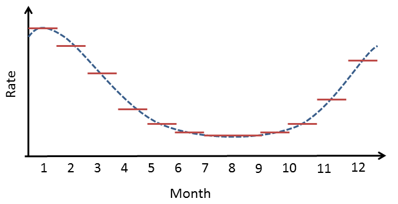

```{r echo = FALSE, message = FALSE, warning = FALSE}
library(SelfControlledCaseSeries)
outputFolder <- "d:/temp/vignetteSccs"
folderExists <- dir.exists(outputFolder)
```
# Introduction

This vignette describes how you can use the `SelfControlledCaseSeries` package to perform a single Self-Controlled Case Series (SCCS) study. We will walk through all the steps needed to perform an exemplar study, and we have selected the well-studied topic of the effect of NSAIDs on gastrointestinal (GI) bleeding-related hospitalization. For simplicity, we focus on one NSAID: diclofenac.

## Terminology

The following terms are used consistently throughout the package:

- **Case**: a person having one or more outcomes .
- **Observation period**: the time when a case is observed in the database. One case can have more than one observation period, but only observation periods that contain an outcome are considered.
- **Naive period**: the first part of a person's observation period (e.g. the first 180 days). This is typically removed from the SCCS model to avoid exposure and incident outcome misclassification. For example, if we observe the outcome on the second day of a person's observation period, we do not know whether the outcome is a new one or just a follow-up for an old one, and whether the patient may have started the exposure just prior to observation start without us knowing about it.
- **Nesting cohort**: the observation period can be restricted to the time when a case belongs to a certain cohort. This is typically the indication of the drug. For example, if the drug treats diabetes, we may want to nest the analysis in the time when people have diabetes to avoid (time-varying) confounding by indication.
- **Study population**: the set of cases having a specific outcome, and their observation periods, that meet certain criteria, such as the naive period and age restrictions.
- **Era**: a data element extracted from the database denoting a time period for a patient (a case). This can be a cohort, but also a drug era. 
- **SCCS data**: a data object containing information on cases, observation periods, nesting cohorts, and eras.
- **Covariate**: a time-varying variable used as a predictor for the outcome in the SCCS model. These include splines and era covariates.
- **Era covariate**: a covariate derived from an era. Multiple covariates can be derived from a single era (e.g. a covariate for when on a drug, and a covariate for the pre-exposure time prior to the drug). One covariate can be derived from multiple eras (e.g. one covariate can represent a class of drugs).
- **SCCS interval data**: data of cases chopped into intervals during which all covariates have a constant value. For splines (e.g for season), the effect is assumed to be constant within each calendar month.
- **SCCS model**: a Poisson regression of SCCS interval data, condition on the observation period.

# Installation instructions

Before installing the `SelfControlledCaseSeries` package make sure you have Java available.  For Windows users, RTools is also necessary. See [these instructions](https://ohdsi.github.io/Hades/rSetup.html) for properly configuring your R environment.

The `SelfControlledCaseSeries` package is maintained in a [Github repository](https://github.com/OHDSI/SelfControlledCaseSeries), and can be downloaded and installed from within R using the `remotes` package:

```{r eval=FALSE}
install.packages("remotes")
library(remotes)
install_github("ohdsi/SelfControlledCaseSeries") 
```

Once installed, you can type `library(SelfControlledCaseSeries)` to load the package.

# Overview

In the `SelfControlledCaseSeries` package a study requires at least three steps:

1. Loading the necessary data from the database.

2. Transforming the data into a format suitable for an SCCS study. This step can be broken down in multiple tasks:

    - Defining a study population, people having a specific outcome, with possible further restrictions such as age.
    - Creating covariates based on the variables extracted from the database, such as defining risk windows based on exposures. 
    - Transforming the data into non-overlapping time intervals, with information on the various covariates and outcomes per interval.

3. Fitting the model using conditional Poisson regression.

In the following sections these steps will be demonstrated for increasingly complex studies.

# Studies with a single drug

## Configuring the connection to the server

We need to tell R how to connect to the server where the data are. `SelfControlledCaseSeries` uses the `DatabaseConnector` package, which provides the `createConnectionDetails` function. Type `?createConnectionDetails` for the specific settings required for the various database management systems (DBMS). For example, one might connect to a PostgreSQL database using this code:

```{r eval=FALSE}
connectionDetails <- createConnectionDetails(dbms = "postgresql", 
                                             server = "localhost/ohdsi", 
                                             user = "joe", 
                                             password = "supersecret")

cdmDatabaseSchema <- "my_cdm_data"
cohortDatabaseSchema <- "my_results"
options(sqlRenderTempEmulationSchema = NULL)
cdmVersion <- "5"
```

The last three lines define the `cdmDatabaseSchema` and `cohortDatabaseSchema` variables,as well as the CDM version. We'll use these later to tell R where the data in CDM format live, where we have stored our cohorts of interest, and what version CDM is used. Note that for Microsoft SQL Server, 'databaseSchemas' need to specify both the database and the schema, so for example `cdmDatabaseSchema <- "my_cdm_data.dbo"`.

## Preparing the health outcome of interest

We need to define the exposures and outcomes for our study. One way to do this is by writing SQL statements against the OMOP CDM that populate a table of events in which we are interested. The resulting table should have the same structure as the `cohort` table in the CDM. This means it should have the fields `cohort_definition_id`, `cohort_start_date`, `cohort_end_date`, and `subject_id`. 

For our example study, we have created a file called *vignette.sql* with the following contents:

```sql
/***********************************
File vignette.sql 
***********************************/

DROP TABLE IF EXISTS @cohortDatabaseSchema.@outcomeTable;

SELECT 1 AS cohort_definition_id,
	condition_start_date AS cohort_start_date,
	condition_end_date AS cohort_end_date,
	condition_occurrence.person_id AS subject_id
INTO @cohortDatabaseSchema.@outcomeTable
FROM @cdmDatabaseSchema.condition_occurrence
INNER JOIN @cdmDatabaseSchema.visit_occurrence
	ON condition_occurrence.visit_occurrence_id = visit_occurrence.visit_occurrence_id
WHERE condition_concept_id IN (
		SELECT descendant_concept_id
		FROM @cdmDatabaseSchema.concept_ancestor
		WHERE ancestor_concept_id = 192671 -- GI - Gastrointestinal haemorrhage
		)
	AND visit_occurrence.visit_concept_id IN (9201, 9203);
```

This is parameterized SQL which can be used by the `SqlRender` package. We use parameterized SQL so we do not have to pre-specify the names of the CDM and cohort schemas. That way, if we want to run the SQL on a different schema, we only need to change the parameter values; we do not have to change the SQL code. By also making use of translation functionality in `SqlRender`, we can make sure the SQL code can be run in many different environments.

```{r eval=FALSE}
library(SqlRender)
sql <- readSql("vignette.sql")
sql <- render(sql,
              cdmDatabaseSchema = cdmDatabaseSchema, 
              cohortDatabaseSchema = cohortDatabaseSchema,
              outcomeTable = "my_outcomes")
sql <- translate(sql, targetDialect = connectionDetails$dbms)

connection <- connect(connectionDetails)
executeSql(connection, sql)
```

In this code, we first read the SQL from the file into memory. In the next line, we replace the three parameter names with the actual values. We then translate the SQL into the dialect appropriate for the DBMS we already specified in the `connectionDetails`. Next, we connect to the server, and submit the rendered and translated SQL.

If all went well, we now have a table with the outcome of interest. We can see how many events:

```{r eval=FALSE}
sql <- paste("SELECT cohort_definition_id, COUNT(*) AS count",
             "FROM @cohortDatabaseSchema.@outcomeTable",
             "GROUP BY cohort_definition_id")
sql <- render(sql, 
              cohortDatabaseSchema = cohortDatabaseSchema, 
              outcomeTable = "my_outcomes")
sql <- translate(sql, targetDialect = connectionDetails$dbms)

querySql(connection, sql)
```
```{r echo=FALSE,message=FALSE}
data.frame(cohort_concept_id = c(1),count = c(1029443))
```

## Extracting the data from the server

Now we can tell `SelfControlledCaseSeries` to extract all necessary data for our analysis:

```{r eval=FALSE}
diclofenac <- 1124300

sccsData <- getDbSccsData(connectionDetails = connectionDetails,
                          cdmDatabaseSchema = cdmDatabaseSchema,
                          outcomeDatabaseSchema = cohortDatabaseSchema,
                          outcomeTable = outcomeTable,
                          outcomeIds = 1,
                          exposureDatabaseSchema = cdmDatabaseSchema,
                          exposureTable = "drug_era",
                          exposureIds = diclofenac,
                          cdmVersion = cdmVersion)
sccsData
```
```{r echo=FALSE,message=FALSE,eval=TRUE}
diclofenac <- 1124300
if (folderExists) {
  sccsData <- loadSccsData(file.path(outputFolder, "data1.zip"))
} 
```
```{r echo=FALSE,message=FALSE}
if (folderExists) {
  sccsData
}
```

There are many parameters, but they are all documented in the `SelfControlledCaseSeries` manual. In short, we are pointing the function to the table created earlier and indicating which cohort ID in that table identifies the outcome. Note that it is possible to fetch the data for multiple outcomes at once. We further point the function to the `drug_era` table, and specify the concept ID of our exposure of interest: diclofenac. Again, note that it is also possible to fetch data for multiple drugs at once. In fact, when we do not specify any exposure IDs the function will retrieve the data for all the drugs found in the `drug_era` table.

All data about the patients, outcomes and exposures are extracted from the server and stored in the `sccsData` object. This object uses the `Andromeda` package to store information in a way that ensures R does not run out of memory, even when the data are large. 

We can use the generic `summary()` function to view some more information of the data we extracted:

```{r eval=FALSE}
summary(sccsData)
```
```{r echo=FALSE,message=FALSE}
if (folderExists) {
  summary(sccsData)
}
```

### Saving the data to file

Creating the `sccsData` file can take considerable computing time, and it is probably a good idea to save it for future sessions. Because `sccsData` uses `Andromeda`, we cannot use R's regular save function. Instead, we'll have to use the `saveSccsData()` function:

```{r eval=FALSE}
saveSccsData(sccsData, "diclofenacAndGiBleed.zip")
```

We can use the `loadSccsData()` function to load the data in a future session.

## Creating the study population

From the data fetched from the server we can now define the population we wish to study. If we retrieved data for multiple outcomes, we should now select only one, and possibly impose further restrictions:

```{r eval=FALSE}
studyPop <- createStudyPopulation(sccsData = sccsData,
                                  outcomeId = 1,
                                  firstOutcomeOnly = FALSE,
                                  naivePeriod = 180)
```

Here we specify we wish to study the outcome with ID 1. Since this was the only outcome for which we fetched the data, we could also have skipped this argument. We furthermore specify that the first 180 days of observation of every person, the so-called 'naive period', will be excluded from the analysis. Note that data in the naive period will be used to determine exposure status at the start of follow-up (after the end of the naive period). We also specify we will use all occurrences of the outcome, not just the first one per person. 

We can find out how many people (if any) were removed by any restrictions we imposed:

```{r eval=FALSE}
getAttritionTable(studyPop)
```
```{r echo=FALSE,message=FALSE}
if (folderExists) {
  studyPop <- readRDS(file.path(outputFolder, "studyPop.rds"))
  getAttritionTable(studyPop)
}
```

## Defining a simple model

Next, we can use the data to define a simple model to fit:

```{r eval=FALSE}
covarDiclofenac <- createEraCovariateSettings(label = "Exposure of interest",
                                              includeEraIds = diclofenac,
                                              start = 0,
                                              end = 0,
                                              endAnchor = "era end")

sccsIntervalData <- createSccsIntervalData(
  studyPopulation = studyPop,
  sccsData = sccsData,
  eraCovariateSettings = covarDiclofenac
)

summary(sccsIntervalData)
```
```{r echo=FALSE,message=FALSE}
if (folderExists) {
  sccsIntervalData <- loadSccsIntervalData(file.path(outputFolder, "intervalData1.zip"))
  summary(sccsIntervalData)
}
```

In this example, we use the `createEraCovariateSettings` to define a single covariate: exposure to diclofenac. We specify that the risk window is from start of exposure to the end by setting start and end to 0, and defining the anchor for the end to be the era end, which for drug eras is the end of exposure. 

We then use the covariate definition in the `createSccsIntervalData` function to generate the `sccsIntervalData`. This represents the data in non-overlapping time intervals, with information on the various covariates and outcomes per interval. 

## Model fitting

The `fitSccsModel` function is used to fit the model:

```{r eval=FALSE}
model <- fitSccsModel(sccsIntervalData)
```

We can inspect the resulting model:

```{r eval=FALSE}
model
```
```{r echo=FALSE,message=FALSE}
if (folderExists){
  model <- readRDS(file.path(outputFolder, "simpleModel.rds"))
  model
}
```

This tells us what the estimated relative risk (the incidence rate ratio) is during exposure to diclofenac compared to non-exposed time. 

## Adding a pre-exposure window

The fact that NSAIDs like diclofenac can cause GI bleeds is well known to doctors, and this knowledge affects prescribing behavior. For example, a patient who has just had a GI bleed is not likely to be prescribed diclofenac. This may lead to underestimation of the rate during unexposed time, because the unexposed time includes time just prior to exposure where observing of the outcome is unlikely because of this behavior. One solution to this problem that is often used is to introduce a separate 'risk window' just prior to exposure, to separate it from the remaining unexposed time. We can add such a 'pre-exposure window' to our analysis:

```{r eval=FALSE}
covarPreDiclofenac <- createEraCovariateSettings(label = "Pre-exposure",
                                                 includeEraIds = diclofenac,
                                                 start = -60,
                                                 end = -1,
                                                 endAnchor = "era start")

sccsIntervalData <- createSccsIntervalData(
  studyPopulation = studyPop,
  sccsData = sccsData,
  eraCovariateSettings = list(covarDiclofenac, 
                              covarPreDiclofenac)
)

model <- fitSccsModel(sccsIntervalData)
```

Here we created a new covariate definition in addition to the first one. We define the risk window to start 60 days prior to exposure, and end on the day just prior to exposure. We combine the two covariate settings in a list for the `createSccsIntervalData` function. Again, we can take a look at the results:

```{r eval=FALSE}
model
```
```{r echo=FALSE,message=FALSE}
if (folderExists) {
  model <- readRDS(file.path(outputFolder, "preExposureModel.rds"))
  model
}
```

Here we indeed see a lower relative risk in the time preceding the exposure, indicating the outcome might be a contra-indication for the drug of interest.

## Including seasonality, and calendar time

Often both the rate of exposure and the outcome change with age, and can even depend on the season or calendar time in general (e.g. rates may be higher in 2021 compared to 2020). This may lead to confounding and may bias our estimates. To correct for this we can include age, season, and/or calendar time into the model. 

For computational reasons we assume the effect of age, season, and calendar time are constant within each calendar month. We assume that the rate from one month to the next can be different, but we also assume that subsequent months have somewhat similar rates. This is implemented by using cubic spline functions.


*Figure 1*. Example of how a spline is used for seasonality: within a month, the risk attributable to seasonality is assumed to be constant, but from month to month the risks are assumed to follow a cyclic cubic spline.

Note that the by default all people that have the outcome will be used to estimate the effect of age, seasonality, and calendar time on the outcome, so not just the people exposed to the drug of interest. Adjusting for age typically only makes sense for small children, where a small difference in age can still make a big difference (remember: we are modeling the effect of age in each person by themselves, not the effect of age across persons). Since age and calendar time are often hard to fit simultaneously, it is often best to only mode seasonality, and calendar time, like this:


```{r eval=FALSE}
seasonalityCovariateSettings <- createSeasonalityCovariateSettings(seasonKnots = 5)

calendarTimeSettings <- createCalendarTimeCovariateSettings(calendarTimeKnots = 5)

sccsIntervalData <- createSccsIntervalData(
  studyPopulation = studyPop,
  sccsData = sccsData,
  eraCovariateSettings = list(covarDiclofenac,
                              covarPreDiclofenac),
  seasonalityCovariateSettings = seasonalityCovariateSettings,
  calendarTimeCovariateSettings = calendarTimeSettings
)
  
model <- fitSccsModel(sccsIntervalData)
```

Again, we can inspect the model:

```{r eval=FALSE}
model
```
```{r echo=FALSE,message=FALSE}
if (folderExists) {
  model <- readRDS(file.path(outputFolder, "seasonCalendarTimeModel.rds"))
  model
}
```

We see that our estimates for exposed and pre-exposure time have not changes much. We can plot the spline curves for season, and calendar time to learn more:

```{r eval=FALSE}
plotSeasonality(model)
```
```{r echo=FALSE,message=FALSE}
if (folderExists) {
  plotSeasonality(model)
}
```

```{r eval=FALSE}
plotCalendarTimeEffect(model)
```
```{r echo=FALSE,message=FALSE}
if (folderExists) {
  plotCalendarTimeEffect(model)
}
```

We do not see a strong effect for season, but we do see an increasing trend over the years, with a drop near the end of observation time.

## Considering event-dependent observation time

The SCCS method requires that observation periods are independent of outcome times. This requirement is violated when outcomes increase the mortality rate, since censoring of the observation periods is then event-dependent. A modification to the SCCS has been proposed that attempts to correct for this. First, several models are fitted to estimate the amount and shape of the event-dependent censoring, and the best fitting model is selected. Next, this model is used to reweigh various parts of the observation time. This approach is also implemented in this package, and can be turned on using the `eventDependentObservation` argument of the `createSccsIntervalData` function. However, this method has proven to be somewhat unstable in combinations with other corrections, so for now it is best to keep the model simple:

```{r eval=FALSE}
sccsIntervalData <- createSccsIntervalData(
  studyPopulation = studyPop,
  sccsData = sccsData,
  eraCovariateSettings = list(covarDiclofenac,
                              covarPreDiclofenac),
  eventDependentObservation = TRUE
)

model <- fitSccsModel(sccsIntervalData)
```

Again, we can inspect the model:

```{r eval=FALSE}
model
```
```{r echo=FALSE,message=FALSE}
if (folderExists) {
  model <- readRDS(file.path(outputFolder, "eventDepModel.rds"))
  model
}
```

# Studies with more than one drug

Although we are usually interested in the effect of a single drug or drug class, it could be beneficial to add exposure to other drugs to the analysis if we believe those drugs represent time-varying confounders that we wish to correct for.

## Adding a class of drugs

For example, oftentimes diclofenac is co-prescribed with proton-pump inhibitors (PPIs) to mitigate the risk of GI bleeding. We would like our estimate to represent just the effect of the diclofenac, so we need to keep the effect of the PPIs separate. First we have to retrieve the information on PPI exposure from the database:

```{r eval=FALSE}
diclofenac <- 1124300
ppis <- c(911735, 929887, 923645, 904453, 948078, 19039926)

sccsData <- getDbSccsData(connectionDetails = connectionDetails,
                          cdmDatabaseSchema = cdmDatabaseSchema,
                          outcomeDatabaseSchema = cohortDatabaseSchema,
                          outcomeTable = outcomeTable,
                          outcomeIds = 1,
                          exposureDatabaseSchema = cdmDatabaseSchema,
                          exposureTable = "drug_era",
                          exposureIds = c(diclofenac, ppis),
                          cdmVersion = cdmVersion)
sccsData
```
```{r echo=FALSE,message=FALSE,eval=TRUE}
ppis <- c(911735, 929887, 923645, 904453, 948078, 19039926)
if (folderExists) {
  sccsData <- loadSccsData(file.path(outputFolder, "data2.zip"))
} 
```
```{r echo=FALSE,message=FALSE}
if (folderExists) {
  sccsData
}
```

Once retrieved, we can use the data to build and fit our model:

```{r eval=FALSE}
studyPop <- createStudyPopulation(sccsData = sccsData,
                                  outcomeId = 1,
                                  firstOutcomeOnly = FALSE,
                                  naivePeriod = 180)

covarPpis <- createEraCovariateSettings(label = "PPIs",
                                        includeEraIds = ppis,
                                        stratifyById = FALSE,
                                        start = 1,
                                        end = 0,
                                        endAnchor = "era end")

sccsIntervalData <- createSccsIntervalData(
  studyPopulation = studyPop,
  sccsData = sccsData,
  eraCovariateSettings = list(covarDiclofenac,
                              covarPreDiclofenac,
                              covarPpis),
  ageCovariateSettings = ageCovariateSettings,
  seasonalityCovariateSettings = seasonalityCovariateSettings,
  calendarTimeCovariateSettings = calendarTimeSettings
)

model <- fitSccsModel(sccsIntervalData)
```

Here, we added a new covariate based on the list of concept IDs for the various PPIs. In this example we set `stratifyById` to `FALSE`, meaning that we will estimate a single incidence rate ratio for all PPIs, so one estimate for the entire class of drugs. Note that duplicates will be removed: if a person is exposed to two PPIs on the same day, this will be counted only once when fitting the model. Furthermore, we have set the `start` day to 1 instead of 0. The reason for this is that PPIs will also be used to treat GI bleeds, and are likely to be prescribed on the same day as the event. If we would include day 0, the risk of the outcome would be attributed to the PPI used for treatment, not the other factors that caused the GI bleed such as any exposure to our drug of interest. Again, we can inspect the model:

```{r eval=FALSE}
model
```
```{r echo=FALSE,message=FALSE}
if (folderExists) {
  model <- readRDS(file.path(outputFolder, "ppiModel.rds"))
  model
}
```

## Adding all drugs

Another approach could be to add all drugs into the model. Again, the first step is to get all the relevant data from the database:

```{r eval=FALSE}
sccsData <- getDbSccsData(connectionDetails = connectionDetails,
                          cdmDatabaseSchema = cdmDatabaseSchema,
                          outcomeDatabaseSchema = cohortDatabaseSchema,
                          outcomeTable = outcomeTable,
                          outcomeIds = 1,
                          exposureDatabaseSchema = cdmDatabaseSchema,
                          exposureTable = "drug_era",
                          exposureIds = c(),
                          cdmVersion = cdmVersion)
```

Note that the `exposureIds` argument is left empty. This will cause data for all concepts in the exposure table to be retrieved. Next, we simply create a new set of covariates, and fit the model:

```{r eval=FALSE}
studyPop <- createStudyPopulation(sccsData = sccsData,
                                  outcomeId = 1,
                                  firstOutcomeOnly = FALSE,
                                  naivePeriod = 180)

covarAllDrugs <- createEraCovariateSettings(label = "Other exposures",
                                            excludeEraIds = diclofenac,
                                            stratifyById = TRUE,
                                            start = 1,
                                            end = 0,
                                            endAnchor = "era end",
                                            allowRegularization = TRUE)

sccsIntervalData <- createSccsIntervalData(
  studyPopulation = studyPop,
  sccsData = sccsData,
  eraCovariateSettings = list(covarDiclofenac,
                              covarPreDiclofenac,
                              covarAllDrugs),
  seasonalityCovariateSettings = seasonalityCovariateSettings,
  calendarTimeCovariateSettings = calendarTimeSettings
)

model <- fitSccsModel(sccsIntervalData)
```

The first thing to note is that we have defined the new covariates to be all drugs except diclofenac by not specifying the `includeEraIds` and setting the `excludeEraIds` to the concept ID of diclofenac. Furthermore, we have specified that `stratifyById` is TRUE, meaning an estimate will be produced for each drug. 

We have set `allowRegularization` to `TRUE`, meaning we will use regularization for all estimates in this new covariate set. Regularization means we will impose a prior distribution on the effect size, effectively penalizing large estimates. This helps fit the model, for example when some drugs are rare, and when drugs are almost often prescribed together and their individual effects are difficult to untangle.

Because there are now so many estimates, we will export all estimates to a data frame using `getModel()`:

```{r eval=FALSE}
  estimates <- getModel(model)
  estimates[estimates$originalEraId == diclofenac, ]
```
```{r echo=FALSE,message=FALSE}
if (folderExists) {
  model <- readRDS(file.path(outputFolder, "allDrugsModel.rds"))
  estimates <- getModel(model)
  estimates[estimates$originalEraId == diclofenac, ]
}
```

Here we see that despite the extensive adjustments that are made in the model, the effect estimates for diclofenac have remained nearly the same. 

In case we're interested, we can also look at the effect sizes for the PPIs:

```{r eval=FALSE}
estimates[estimates$originalEraId %in% ppis, ]
```
```{r echo=FALSE,message=FALSE}
if (folderExists) {
  estimates[estimates$originalEraId %in% ppis, ]
}
```

Note that because we used regularization, we are not able to compute the confidence intervals for these estimates. 


# Diagnostics

We can perform several diagnostics on the data to verify whether our assumptions underlying the SCCS are met. 

## Power calculations

We might be interested to know whether we have sufficient power to detect a particular effect size. It makes sense to perform these power calculations once the study population has been fully defined, so taking into account loss to the various inclusion and exclusion criteria. This means we will use the `sccsIntervalData` object we've just created as the basis for our power calculations. Since the sample size is fixed in retrospective studies (the data has already been collected), and the true effect size is unknown, the `SelfControlledCaseSeries` package provides a function to compute the minimum detectable relative risk (MDRR) instead:

```{r eval=FALSE}
computeMdrr(sccsIntervalData,
            exposureCovariateId = 1000,
            alpha = 0.05,
            power = 0.8,
            twoSided = TRUE,
            method = "binomial")
```
```{r echo=FALSE,message=FALSE}
if (folderExists) {
  computeMdrr(sccsIntervalData,
              exposureCovariateId = 1000,
              alpha = 0.05,
              power = 0.8,
              twoSided = TRUE,
              method = "binomial")
}
```

Note that we have to provide the covariate ID of the exposure of interest, which we learned by calling `summary` on `sccsIntervalData` earlier. This is because we may have many covariates in our model, but will likely only be interested in the MDRR of one.

## Time from exposure start to event

To gain a better understanding of when the event occurs relative to the start of exposure, we can plot their relationship. Note that we specify the naive period, so this can be applied to the data prior to showing the plot. This will make the plot better in line with the data we ended up fitting:

```{r eval=FALSE}
plotExposureCentered(studyPop, sccsData, exposureEraId = diclofenac)
```
```{r echo=FALSE,message=FALSE,fig.width=6.5, fig.height=5}
if (folderExists) {
  plotExposureCentered(studyPop, sccsData, exposureEraId = diclofenac)
}
```

This plot suggests an increased rate of events in the first few weeks following the start of exposure, perhaps because of an acute effect.

## Increased risk pre-exposure

If the rate just before exposure is higher compared to during exposure, this indicates there might reverse causality: that the outcome, or some precursor of the outcome, increases the probability of having the exposure. To avoid incorrect causal inference, we want to detect these situations. We can compute a p-value for whether rate is increased pre-exposure:

```{r eval=FALSE}
computePreExposureGainP(sccsData, studyPopulation, exposureEraId = diclofenac) 
```
```{r echo=FALSE,message=FALSE,fig.width=6.5, fig.height=5}
if (folderExists) {
  computePreExposureGainP(sccsData, studyPop, exposureEraId = diclofenac) 
}
```
If this p-value is lower than a prespecified threshold (e.g. p < 0.05), we can decide to reject the null hypothesis that the rate is not increased, and we probably should not trust our analysis to produce reliable estimates.

## Ages covered per subject

We can visualize which age ranges are covered by each subject's observation time:

```{r eval=FALSE}
plotAgeSpans(studyPop)
```
```{r echo=FALSE,message=FALSE}
if (folderExists) {
  plotAgeSpans(studyPop)
}
```

Here we see that most observation periods span only a small age range, making it unlikely that any within-person age-related effect will be large.

## Dependency between events and observation end

To understand whether censoring is dependent on the event, which would violate one of the assumptions of the SCCS, we can plot the difference in distribution between censored and uncensored events. By 'censored' we mean periods that end before we would normally expect. Here, we define periods to be uncensored if they end at either the study end date (if specified), database end date (i.e. the date after which no data is captured in the database), or maximum age (if specified). All other periods are assumed to be censored.

```{r eval=FALSE}
plotEventObservationDependence(studyPop)
```
```{r echo=FALSE,message=FALSE}
if (folderExists) {
  sccsData <- loadSccsData(file.path(outputFolder, "data1.zip"))
  plotEventObservationDependence(studyPop)
}
```

Here we see that overall the two distributions are somewhat similar, with little evidence that censoring tends to lead to shorter times to the end of observation.

## Stability of the outcome over calendar time

If the rate of the outcome changes as a function of calendar time, this could introduce bias. For example, if the outcome is more prevalent during winter, and the exposure also tends to occur in winter, this will create an association between the two that likely doesn't imply causation. We can check for patterns over time:

```{r eval=FALSE}
plotEventToCalendarTime(studyPop)
```
```{r echo=FALSE,message=FALSE}
if (folderExists) {
  plotEventToCalendarTime(studyPop)
}
```

In the top of the plot, we see the rate of the outcome (within those persons that are observed) does change over time. 

Earlier, we've seen we can adjust for these types of patterns by including splines, for example for age, season, and calendar time. We can use the same plot to evaluate if these adjustments have been sufficient. For example, using the model we fitted earlier adjusting for age, season, and calendar time:

```{r eval=FALSE}
plotEventToCalendarTime(studyPop, model)
```
```{r echo=FALSE,message=FALSE}
if (folderExists) {
  model <- readRDS(file.path(outputFolder, "seasonCalendarTimeModel.rds"))
  plotEventToCalendarTime(studyPop, model)
}
```

Here, the top plot shows the rate of the outcome, after adjusting for the age, season, and calendar time effect. We see that the adjustment wasn't completely effective, and in fact may have over-adjusted. A more formal way to evaluate this is by using:

```{r eval=FALSE}
diagnostic <- computeTimeStability(studyPop, model)
head(diagnostic[, c("monthStartDate", "monthEndDate", "p", "alpha", "stable")])
```
```{r echo=FALSE,message=FALSE}
if (folderExists) {
  diagnostic <- computeTimeStability(studyPop, model)
  head(diagnostic[, c("monthStartDate", "monthEndDate", "p", "alpha", "stable")])
}
```

This shows that, even after adjustment using the splines, there are months where the rate differs significantly from the mean rate, indicating temporal instability. We may want to change the knots in the splines, or possibly restrict our analysis to calendar time that is more stable.


# Acknowledgments

Considerable work has been dedicated to provide the `SelfControlledCaseSeries` package.

```{r eval=TRUE}
citation("SelfControlledCaseSeries")
```

Furthermore, `SelfControlledCaseSeries` makes extensive use of the `Cyclops` package.

```{r eval=TRUE}
citation("Cyclops")
```

Part of the code (related to event-dependent observation periods) is based on the SCCS package by Yonas Ghebremichael-Weldeselassie, Heather Whitaker, and Paddy Farrington.

This work is supported in part through the National Science Foundation grant IIS 1251151.
